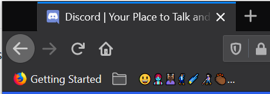

# Origin Marker 🎆
A browser extension to allow users to easily identify some phishing attempts also includes a universal automatic mode all done client side.  
 

# How to setup
Get the extension then create a folder in the bookmarks bar (location of your choice) with the name of * it will then automatically get renamed.

# How to use
Rename the folder/marker on the origin or just use Automatic mode.

# Automatic mode
If no Marker name is set emojis will be used to identify the origin.  
This works by using a sha256 hash of the origin encoded into emoji.

# Origin
The Origin is based of the protocol, hostname and port number of a URL
