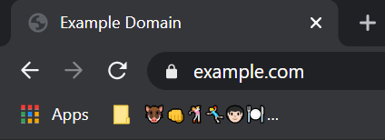
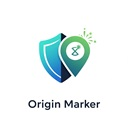

# OriginMarker

 

Allows you to easily identify phishing domains with a marker in the bookmarks bar that changes based off the active origin/domain your currently on.
It can be renamed per origin manually or automatic using the hash of the origin encoded in emoji.

# How to setup

- Add or rename a **bookmark** in the bookmarks bar with its title set to the ID of the mode (e.g., `*` or `**`).
- It will then automatically get renamed.

# How to use

- Rename the folder/marker on the origin or just use Automatic mode.
- When you rename a marker it will not change the mode.

# Automatic mode (ID: \*)

It will be different emojis per origin than other users (due to a unique, locally generated salt).

# Manual only (ID: \*\*)

Markers will not get a automatic value.

# Security Policy

For information on how security is handled in this project, please review our [Security Policy](security.md).
