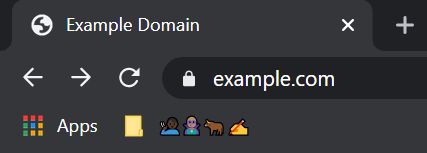

# Origin Marker
A browser extension to allow users to easily identify some phishing attempts also includes a universal automatic mode all done client side.  

# How to setup
Get the extension then create a folder in the bookmarks bar (location of your choice) with the name of * it will then automatically get renamed to "Marker"

# How to use
Rename the folder/marker on the origin

# Automatic mode
If no Marker name is set 4 emojis will be used to identify the origin.  
This works by using the first 9 letters of a sha256 hash of the origin encoded into emoji.
